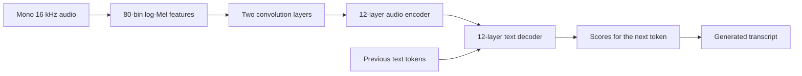

# Whisper training: beginner guide

Start with `notebooks/whisper/setup.ipynb`. The workflow is written with ordinary
variables, tables, small functions, and loops. Every implementation file is a
notebook. Each stage imports its libraries and loads missing prerequisites when
opened in a fresh kernel. The runner executes the stages in one Python session.

This project fine-tunes the complete pretrained **Whisper-small** model on
Karakalpak speech: all **241,734,912 parameters** can change. It uses every
training recording after validation is reserved. Source CSVs and WAVs are only
read; model outputs go under the ignored `checkpoints/` folder.

## Run it

From the repository root:

```bash
uv run ipython -c "get_ipython().run_line_magic('run', 'notebooks/whisper/setup.ipynb'); run_notebooks(train=True)"
```

This loads setup, checks the dataset and model, trains for three epochs, then
scores the best checkpoint on validation. For a check without training:

```bash
uv run ipython -c "get_ipython().run_line_magic('run', 'notebooks/whisper/setup.ipynb'); run_notebooks(train=False)"
```

In Jupyter, run the setup cells and enter `run_notebooks(train=True)` when ready to train. Read
the numbered notebooks to follow each step. Each stage imports its own libraries and loads earlier data/model steps when
needed. Training is disabled by default, including when an individual notebook
is opened. The runner requires `train=True` to start learning.
The runner does not rewrite notebook files or saved cell outputs. A failing
code cell stops the workflow immediately.

After a completed experiment, change `RUN_NAME` in setup before training again.
A nonempty experiment folder is refused so an earlier model is not replaced.
Local audio is not included in a fresh clone. `LOCAL_FILES_ONLY = True` uses the
model already cached on this Mac; set it to `False` if weights need downloading.

## Select the correct kernel and see progress

The project environment has pandas and PyTorch installed. Choose
**Whisper (project .venv)** from the notebook's kernel selector. Its interpreter
is `/Users/macbook/Documents/IT/repos/AI & ML/.venv/bin/python`.
A kernel using another Python environment may not have these packages.

Start Jupyter from the project environment if needed:

```bash
uv run jupyter lab
```

The named kernel has been registered inside the project `.venv`. To register it
again after recreating the environment:

```bash
uv run python -m ipykernel install --sys-prefix --name whisper-project --display-name "Whisper (project .venv)"
```

For training with a visual monitor:

1. In setup, choose a fresh `RUN_NAME`, run its cells, and call
   `run_notebooks(train=True)`. The runner checks data/model inputs, then executes
   training (`04_training.ipynb`) and evaluation (`05_evaluation.ipynb`).
2. In another tab, open `07_progress.ipynb` using the named kernel. Change
   `RUN_TO_WATCH` to the same run name and click **Run All**.
3. Rerun the viewer's cells to refresh. The bar shows training-epoch or evaluation
   progress, the loss curve shows weight updates, and the epoch chart appears
   after the first validation pass.

New runs save `loss_history.csv`, so plots work for both notebook and terminal
training. The viewer uses the old terminal log as a fallback for the stopped
first run. A lower training-loss curve does not by itself prove recognition
accuracy. The viewer reads files only and never loads or starts the model.

## Results from the completed run

The local run `whisper-small-kaa-full-run02` completed three epochs on Apple
MPS. All 241,734,912 Whisper-small parameters were trainable. It used 3,338
training recordings and 370 validation recordings; the separate 927-recording
test split was left untouched.

| Epoch | Training loss | Validation loss | Weight updates |
| ---: | ---: | ---: | ---: |
| 1 | 0.7894 | 0.5626 | 418 |
| 2 | 0.2938 | 0.4665 | 836 |
| 3 | 0.1312 | 0.4586 | 1,254 |

After training, the selected checkpoint transcribed all 370 validation
recordings with **32.45% word error rate (WER)** and **7.31% character error
rate (CER)**. These are validation results for this dataset and decoding setup;
the held-out test set has not been scored, so do not report these as test
results. The validation predictions and scores are in
`checkpoints/whisper-small-kaa-full-run02/validation_metrics.json`.

## Each notebook

The runner uses this order: **setup → data → model → batching → checks → training
→ evaluation**. Checks run before training even though their filename starts
with `06`.

| File | What to read and what it does |
| --- | --- |
| [setup.ipynb](../notebooks/whisper/setup.ipynb) | Imports tools, finds the project, lists editable settings, chooses the device, and defines the short `run_notebooks()` function. |
| [01_data.ipynb](../notebooks/whisper/01_data.ipynb) | Reads train/test CSVs, checks every recording, groups repeated transcripts, and reserves validation from train. |
| [02_model.ipynb](../notebooks/whisper/02_model.ipynb) | Loads the pretrained processor/model, configures the transcription prefix, and verifies that all parameters are trainable. |
| [03_batching.ipynb](../notebooks/whisper/03_batching.ipynb) | Defines `prepare_batch`, builds data loaders from lists of table rows, and checks one real forward loss. |
| [06_checks.ipynb](../notebooks/whisper/06_checks.ipynb) | Uses short assertions to verify split separation, unchanged test membership, valid settings, expected feature shapes, and trainable parameters. |
| [04_training.ipynb](../notebooks/whisper/04_training.ipynb) | Defines `validation_loss` and `train_one_epoch`, prepares the run folder/optimizer, runs three epochs, and saves the best validation checkpoint. These are separate, explained cells. |
| [05_evaluation.ipynb](../notebooks/whisper/05_evaluation.ipynb) | Reloads the best checkpoint, checks saved split membership, generates transcripts, and saves recognition scores and predictions. |
| [07_progress.ipynb](../notebooks/whisper/07_progress.ipynb) | Read-only stage/status, progress bar, training-loss curve, and completed-epoch charts. It never starts training. |

[docs/whisper_training.md](whisper_training.md) is this guide. `README.md` points
to the notebook workflow, and `.gitignore` keeps datasets and checkpoints out of
Git. Existing unrelated repository files are unchanged. No extra Python modules
or notebook-import package are needed.

## The settings in plain language

| Setting | Default | Meaning |
| --- | --- | --- |
| `MODEL_ID` | `openai/whisper-small` | The pretrained model to fine-tune. |
| `RUN_NAME` | `whisper-small-kaa-full-run02` | Name of the output folder; change it for a new experiment. |
| `BATCH_SIZE` | 1 | Recordings processed together in one forward/backward pass. |
| `EPOCHS` | 3 | Complete passes over the training recordings. |
| `LEARNING_RATE` | 0.00001 | Controls how strongly the optimizer changes weights. |
| `ACCUMULATION_STEPS` | 8 | Combine gradients from eight batches before one weight update. |
| `VALIDATION_FRACTION` | 0.10 | Reserve about 10% of original train for checking learning. |
| `RUN_FINAL_TEST` | False | Use validation for scoring; enable final test only after model/settings are selected. |
| `LOCAL_FILES_ONLY` | True | Require locally cached pretrained artifacts. |

The device is selected as CUDA first, then Apple MPS, then CPU. MPS is PyTorch's
Apple GPU backend. CPU works for checks but is much slower for full training.
Gradient checkpointing recomputes intermediate values during backward passes
instead of retaining all of them, reducing memory at the cost of more work.
Training uses float32, AdamW weight decay 0.01, and gradient clipping at norm 1.
There is no learning-rate scheduler, mixed precision, augmentation, or freezing.

## How data becomes a transcript

Whisper-small is an **encoder-decoder Transformer**. The encoder reads the audio;
the decoder predicts the text. It reuses the existing multilingual tokenizer.
The [published model configuration](https://huggingface.co/openai/whisper-small/blob/main/config.json)
records 12 encoder layers, 12 decoder layers, hidden width 768, and 12 attention
heads per layer. Its vocabulary has 51,865 token IDs.



A log-Mel spectrogram describes how audio energy changes across time and
frequency. The processor pads recordings to a 30-second input window, producing
features shaped `[batch, 80, 3000]`. Two convolution layers reduce the time
positions to 1,500. The encoder learns audio context; decoder cross-attention
reads that context while causal self-attention reads preceding text tokens.
The [official model implementation](https://github.com/openai/whisper/blob/main/whisper/model.py)
shows these operations. The decoder's text context is 448 tokens.

A token ID is a number representing a text fragment or a special marker. The
label sequence contains language/task markers, transcript tokens, and an
end-of-transcript marker. Padding becomes `-100` so the loss ignores it. The
model adds its decoder start token when shifting labels, so `prepare_batch`
removes that token once. This matches the
[Whisper fine-tuning recipe](https://huggingface.co/blog/fine-tune-whisper).

`LANGUAGE = "kk"` means **Kazakh** in
[Whisper's language list](https://github.com/openai/whisper/blob/main/whisper/tokenizer.py).
Whisper has no dedicated Karakalpak token; the existing Kazakh proxy is retained
for this experiment. It is not a Karakalpak language code. Compare alternative
prefixes on validation, keeping test scores for final reporting.

Whisper uses sequence-to-sequence cross-entropy, rather than CTC. During training,
it reads the previous correct reference tokens; during recognition, it reads
its own previously generated tokens. This difference is why a forward loss check
alone does not establish recognition quality.

## What happens during training

1. **Check data.** Read all audio, verify mono 16 kHz, finite samples, positive
   duration, and a maximum of 30 seconds. Verify manifest durations within 20 ms
   and paths inside the dataset. This prepared corpus has no exact audio
   duplicates; a duplicate stops the run for review. Repeated normalized
   transcripts stay in the same split. Normalization changes only grouping
   keys, never training text. Overlong audio/text needs matched segmentation.
2. **Reserve validation.** Keep the original 927 test rows untouched. With seed
   42, original train is split into **3,338 train and 370 validation**. Speaker
   IDs are unavailable, so this is not an unseen-speaker guarantee.
3. **Prepare batches.** `prepare_batch` reads only the current batch and makes
   audio features, attention masks, and text labels. The whole corpus's features
   are not stored in RAM. Training rows shuffle; validation rows stay ordered.
4. **Predict and measure loss.** The model predicts token scores, and
   cross-entropy measures disagreement with correct token IDs. Lower loss means
   the model better fits those targets.
5. **Calculate gradients.** `loss.backward()` calculates how each weight affects
   loss. Multiply the batch's mean loss by its real target-token count so the
   accumulation window contains a summed token loss.
6. **Update weights.** Every eight batches, divide gradients by the actual token
   count, clip their norm, and call `optimizer.step()`. The final partial window
   uses its own count. Clear gradients before collecting the next window.
7. **Validate and save.** At the end of every epoch, measure validation loss
   without gradients. Average loss over nonpadding target tokens. Save the
   model and processor to `best/` when validation improves; test never selects
   the checkpoint.
8. **Evaluate recognition.** After all three epochs, reload `best/` and generate
   transcripts for every validation recording. WER counts word substitutions,
   deletions, and insertions divided by reference words; CER uses characters.
   Fractions are multiplied by 100 for display. Insertions can make WER exceed
   100%. Scoring keeps case, punctuation, and diacritics, with ordinary whitespace
   handling. Predictions and references are saved for review.

Final test scoring is a separate decision after choosing settings on validation:
set `RUN_FINAL_TEST = True` and run the evaluation stage in a session with the
preceding data/settings loaded. It scores all 927 test recordings. Generation is
greedy by default and limited to 444 new tokens; reaching the cap may truncate
an output, so inspect longer predictions.

## Checkpoints and local run files

The root `checkpoints/` folder stores local training outputs. Git ignores this
folder so model weights, large archives, and per-recording split manifests
stay out of code pushes. A new clone does not contain these files; run training
again to create them. The completed local run has this layout:

```text
checkpoints/
  whisper-small-kaa-full-run02.zip   # shareable archive of the best/ folder
  whisper-small-kaa-full-run02/
    settings.json                   # model, device, settings, row counts
    train_split.csv                 # exact training recording membership
    validation_split.csv
    test_split.csv                  # reserved rows; not used for selection
    progress.json                  # completed stage and recording count
    loss_history.csv               # loss after each optimizer update
    history.json                   # train/validation loss for each epoch
    best/                           # selected model weights and load files
      model.safetensors             # learned Whisper weights
      config.json                   # model architecture/configuration
      generation_config.json        # transcription generation settings
      tokenizer.json                # text token vocabulary
      tokenizer_config.json         # tokenizer settings
      processor_config.json         # audio feature processor settings
    validation_metrics.json         # WER, CER, references and predictions
    test_metrics.json               # created only when final test is run
```

The ZIP includes the complete `best/` folder; share that archive when someone
needs to load the trained model. The weights alone are insufficient because
the configuration, tokenizer, and processor are needed to use Whisper. The
checkpoint is for inference. Optimizer and random-number state are not saved,
so exact training resume is not implemented. Saved split rows are checked
before recognition scores are reported. There is no distributed or multi-GPU
support.

The earlier `whisper-small-kaa-full-run01` was stopped during its first epoch
at batch 864 of 3,338, after 108 updates. It did not save a model checkpoint.
Its old progress/log files remain locally for inspection.

To follow a running experiment, open `07_progress.ipynb` in a second notebook
tab and set `RUN_TO_WATCH` to the experiment name. A run launched through a
background terminal command can also be followed with `tail -f` on its log file.

## Verification

On 2026-10-10, all eight notebook structures and code syntax passed validation.
After adding imports/prerequisite loading, all eight notebooks ran successfully
in fresh project-environment IPython sessions with training disabled. The named
project kernel was registered, and the progress viewer displayed the stopped run.
The complete workflow ran with training disabled on the **Apple GPU**, using the
actual dataset and pretrained small checkpoint. Data, split, batch, finite-loss,
and all-parameters-trainable checks passed. A separate regression verified that
variable token counts and the final partial accumulation window produce the
same update as one combined token batch. The source datasets were not modified.

A small, randomly initialized Whisper model and real recordings were also used
for an affordable contract check of training, checkpoint save/reload, and
recognition. It was not the full-model training run or an ASR benchmark. The
full-run results above come from the saved run02 history and validation metrics.
